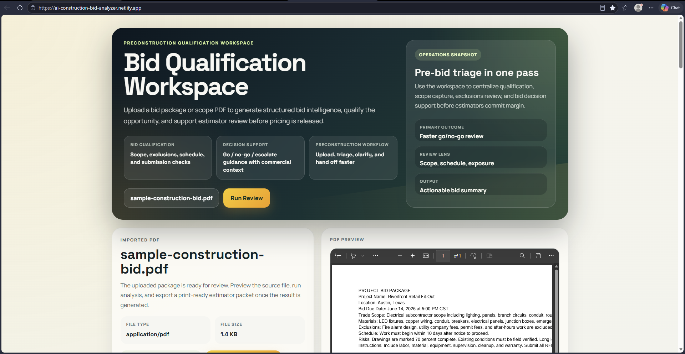
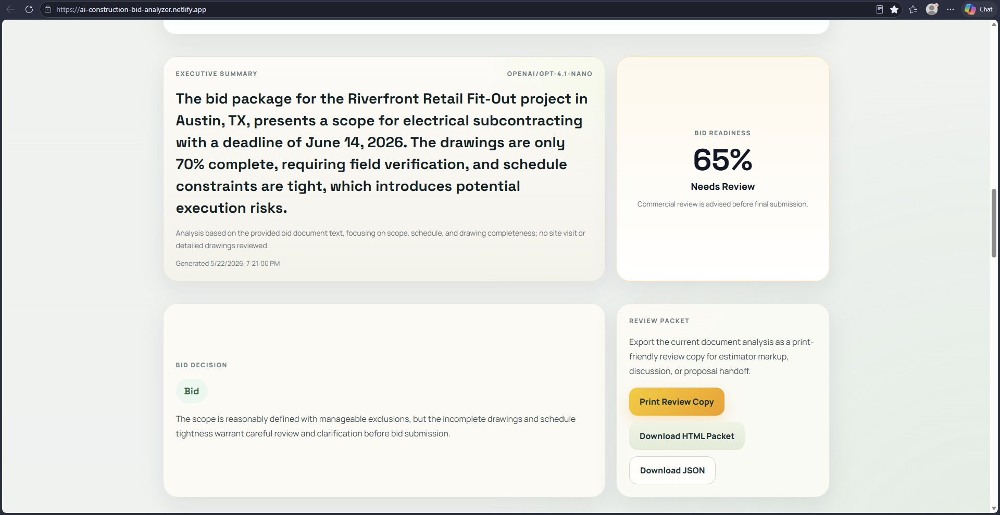
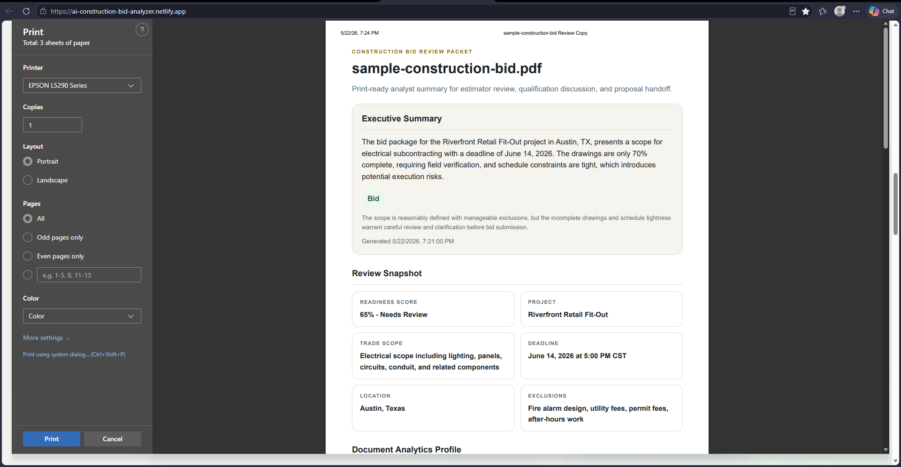
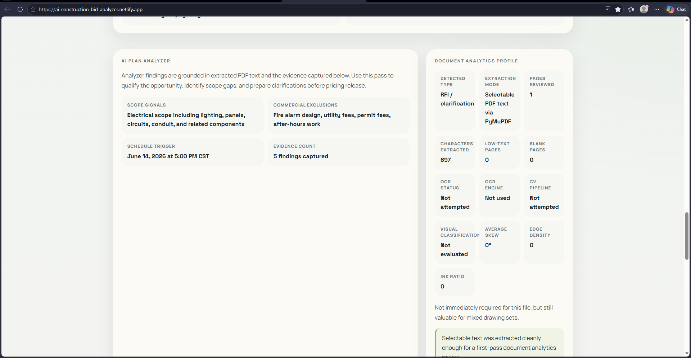
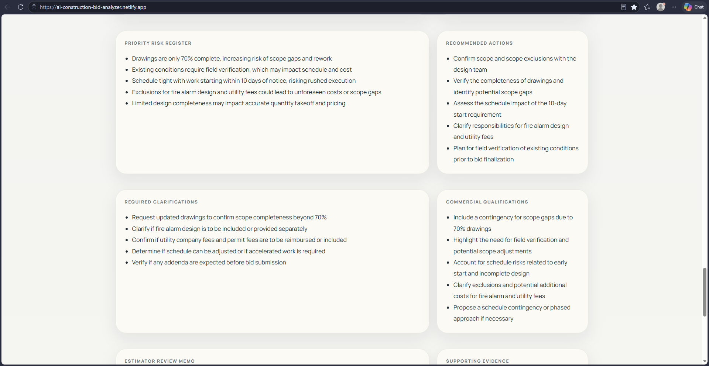

# AI Construction Bid Analyzer

A production-oriented document review workspace for commercial estimating teams.

This application analyzes construction bid PDFs, extracts key bid information, flags risk items, calculates a bid readiness score, and lets users interrogate the document before pricing is finalized.

It is designed as a document-analytics demo for specialty trade preconstruction workflows: Python handles extraction and analysis, while Angular presents a typed operator workspace for qualification and handoff.

## Stack

- Angular 18 + TypeScript frontend
- Python FastAPI AI service
- PyMuPDF for PDF text extraction
- OpenCV preprocessing for scanned-document OCR fallback
- OpenRouter/OpenAI-compatible LLM endpoint
- Netlify-ready frontend
- Render-ready backend
- Extraction quality profile for OCR handoff signals
- Optional OCR fallback for scanned PDFs via OCR.Space

## Demo Live
https://ai-construction-bid-analyzer.netlify.app/


## UI Preview
 







## Project Structure

```txt
ai-construction-bid-analyzer/
  frontend/   Angular app for Netlify
  backend/    FastAPI AI document service for Render
  sample-documents/sample-construction-bid.pdf
```

## Run Backend Locally

```bash
cd backend
python -m venv venv
venv\Scripts\activate
pip install -r requirements.txt
copy .env.example .env
uvicorn main:app --reload
```

If you are preparing the demo on Windows and the existing `venv` folder came from another environment, recreate a fresh local environment instead:

```bash
cd backend
python -m venv .venv-win
.\.venv-win\Scripts\activate
pip install -r requirements.txt
uvicorn main:app --reload
```

Backend runs at:

```txt
http://localhost:8000
```

API docs:

```txt
http://localhost:8000/docs
```

## Run Frontend Locally

```bash
cd frontend
npm install
npm start
```

Frontend runs at:

```txt
http://localhost:4200
```

## OpenRouter Setup

Create `backend/.env`:

```env
OPENROUTER_API_KEY=your_key_here
OPENROUTER_MODEL=openai/gpt-4.1-nano
FRONTEND_ORIGIN=http://localhost:4200
```

The backend has a fallback response, so document processing still works without an AI key, but live AI summary and Q&A require the key.

To enable OCR fallback for scanned PDFs, also add:

```env
OCR_SPACE_API_KEY=your_ocr_space_key_here
OCR_SPACE_ENDPOINT=https://api.ocr.space/parse/image
OCR_SPACE_LANGUAGE=eng
```

If `OCR_SPACE_API_KEY` is configured, the backend will attempt OCR when selectable PDF text is unavailable.
When OCR fallback runs, the backend now renders PDF pages to images, applies OpenCV preprocessing, and reports visual diagnostics such as skew, edge density, and document-type classification before OCR is executed.

## Deploy Backend to Render

1. Push this project to GitHub.
2. Create a new Render Web Service.
3. Root directory: `backend`
4. Build command:

```bash
pip install -r requirements.txt
```

5. Start command:

```bash
uvicorn main:app --host 0.0.0.0 --port $PORT
```

6. Add environment variables:

```env
OPENROUTER_API_KEY=your_key_here
OPENROUTER_MODEL=openai/gpt-4.1-nano
FRONTEND_ORIGIN=https://your-netlify-site.netlify.app
```

## Deploy Frontend to Netlify

1. Create a Netlify site from GitHub.
2. Base directory: `frontend`
3. Build command:

```bash
npm run build
```

4. Publish directory:

```txt
dist/ai-construction-bid-analyzer-frontend/browser
```

5. Update `frontend/src/app/services/bid-analyzer.service.ts` and replace:

```ts
'http://localhost:8000'
```

with your Render backend URL:

```ts
'https://your-render-service.onrender.com'
```

Then redeploy Netlify.

## What This Demonstrates

- Frontend application architecture
- TypeScript models and service layer
- API integration
- Bid intelligence workflow design
- Construction estimating domain awareness
- Cloud-ready deployment design
- Document profiling for OCR/layout-analysis escalation

## Demo Notes

Use [DEMO_TALK_TRACK.md](./DEMO_TALK_TRACK.md) to connect the current implementation to the role's priorities around Python document analytics, Angular integration, LLM orchestration, and production-minded pipeline design.

[RCA_STORIES_LIVE_SYSTEMS.md](./RCA_STORIES_LIVE_SYSTEMS.md).
